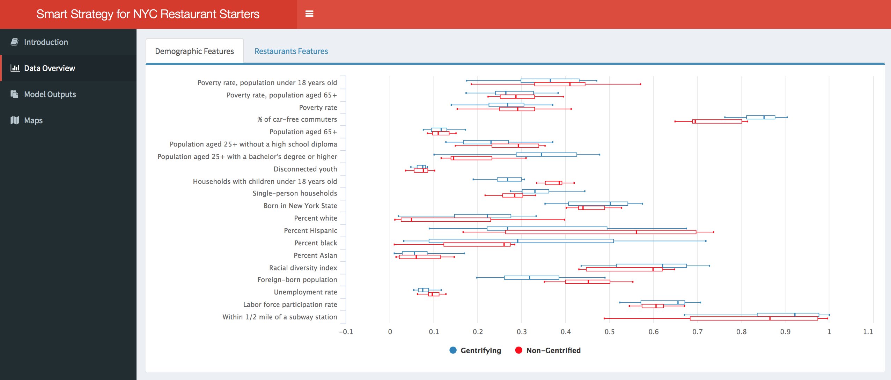
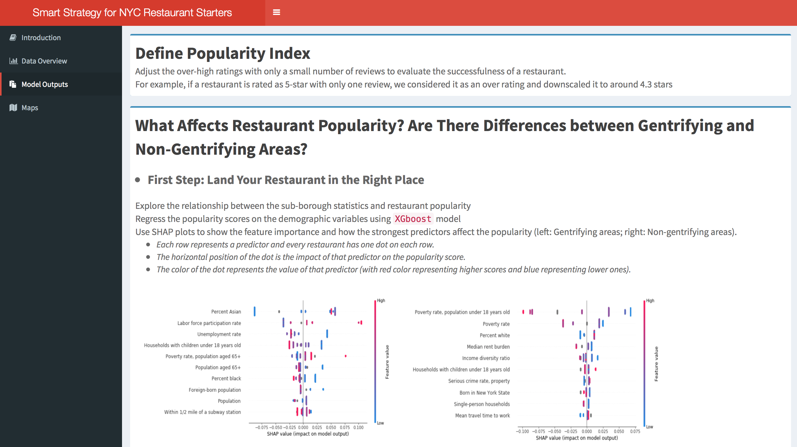
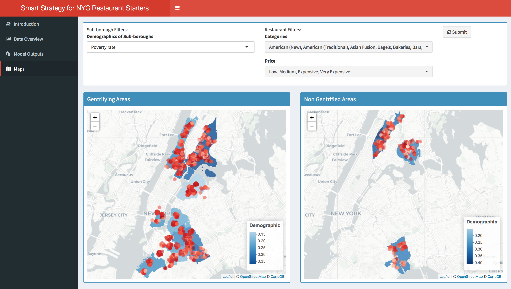

# ADS Project 5: CSC DataFest 2018 Fall

Term: Fall 2018

+ Team # 4
+ Projec title: Smart Strategy for NYC Restaurant Starters
+ Team members
	+ Xiaojing Dong
	+ Lujia Wang
+ Project links
	+ [Python notebook](https://github.com/TZstatsADS/Fall2018-project5-sec2proj5-grp4/blob/master/doc/xgboost_model.ipynb): codes for data cleaning and model fitting
	+ [Shiny App](https://lujiaw.shinyapps.io/SmartStrategyForNYCRestaurantStarter/): Smart Strategy for NYC Restaurant Starters
+ Project summary:
In this project, we are trying to answer the following questions: What affects restaurant popularity? Are there differences between gentrifying and non-gentrifying areas?


To uncover these questions, we first performed EDA on our data, which consisted of two parts, the sub-borough demographics, and the restaurant features (data extracted from Yelp API).


Next, we defined the popularity index, which adjusted the over-high ratings with only a small number of reviews. Then, we applied the XGBoost model for each of the gentrifying and non-gentrifying areas in two steps, and used the SHAP plots to show how the strongest predictors affect the popularity.

+ In the first step, we explored the relationship between the sub-borough statistics and the restaurant popularity to give insights on how to choose the right place.

+ In the second step, we regressed the residuals obtained from the first step on the restaurant features and discussed how pricing and service can further add value to the business.


Finally, we visualized the data on the map. The blue shades represent the sub-borough demographics, and the red dots represent the popularity score for each restaurant. User can select service types and price levels to filter the restaurants.

	
**Contribution statement**:

+ Major contributors: Xiaojing Dong and Lujia Wang.
	+ Xiaojing and Lujia together brainstormed the topic of this project, extracted restaurant data using Yelp API, completed the sophisticated data cleaning process, and developed a Shiny App to visualize our results. Xiaojing carried out the data cleaning of the restaurant data, performed the cross validation of the XGBoost models, generated the SHAP plots, and prepared the presentation. Lujia carried out the data cleaning of the sub-borough demographic data, created the overall structure of the Shiny App, generated the EDA plots and deployed the App.

Following [suggestions](http://nicercode.github.io/blog/2013-04-05-projects/) by [RICH FITZJOHN](http://nicercode.github.io/about/#Team) (@richfitz). This folder is orgarnized as follows.

```
proj/
├── lib/
├── data/
├── doc/
├── figs/
└── output/
```

Please see each subfolder for a README file.
